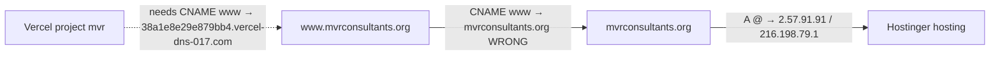

# MVR Consultants — Client Handoff Checklist

Use this document to transfer the full stack to the client's personal accounts **today**.

**Stack:** GitHub → Vercel (frontend) + Render (backend + Redis) → Supabase (Postgres)  
**Domain:** `https://www.mvrconsultants.org`  
**Backend (current):** `https://mvr-umqq.onrender.com`  
**Frontend (Vercel deployment):** `https://mvr.vercel.app` (client project **`mvr`**, team **MvrConsultancy**)  
**Vercel dashboard:** `https://vercel.com/mvr-consultancy/mvr/settings/domains`  
**Supabase project ref:** `vjjykfkbfkfalhqkczsd`

---

## Status tracker

| Service | Owner today | Action | Done |
|---------|-------------|--------|------|
| GitHub repo | **Client** | Transfer ownership | ☑ |
| Supabase | You | Transfer or invite as owner | ☐ |
| Render (`mvr-backend`, `mvr-redis`) | You | Transfer or recreate | ☐ |
| Vercel (frontend) | You | Transfer or import repo | ☐ |
| Cloudinary | **Client** | Copy new keys into Render + Vercel | ☐ |
| Resend | **Client** | Verify domain + copy API key into Render | ☐ |
| DNS (Hostinger) | TBD | Point `www` to client's Vercel | ☐ |

---

## GitHub transferred first — do this now

If GitHub ownership moved to the client **before** Render/Vercel/Supabase handoff, the **live site may still work** (existing deploys keep running), but **new deploys from Git pushes will break** until Render and Vercel reconnect to the client's repo.

### Immediate priority (next 30 minutes)

1. **Export secrets while you still have dashboard access** (Render + Vercel) — see Phase 0 below. Do this before losing access.
2. **Reconnect deploy services to client's GitHub** (or recreate on client's Render/Vercel accounts).
3. **Supabase:** if transfer/backup isn't available, **invite client as Admin** on the project so they have DB access without moving data.

### Reconnect Render to client's GitHub

On **your** Render account (for now):

1. Open `mvr-backend` → **Settings** → **Build & Deploy** → **Repository**
2. Click **Connect account** or **Change repository**
3. Authorize **client's GitHub account** (client may need to log in and grant Render access)
4. Select the repo at `clientUsername/mvr` (or whatever the repo is named)
5. Repeat for any Blueprint / second service if needed
6. Trigger **Manual Deploy** → confirm build succeeds

**Alternative:** Client creates a new Render account → **New Blueprint** from client's repo using [`render.yaml`](render.yaml) → paste all env vars from your export → switch DNS/`BACKEND_URL` when ready.

### Reconnect Vercel to client's GitHub

On **your** Vercel account (for now):

1. Project → **Settings** → **Git**
2. **Disconnect** old Git connection if broken
3. **Connect Git Repository** → client's GitHub → select the transferred repo
4. Confirm **Root Directory** = `frontend`
5. Redeploy

**Alternative:** Client imports repo on **their** Vercel account (root dir `frontend`) → copy env vars → point DNS to new Vercel project.

### Supabase when transfer/backup isn't available

You don't need a backup to keep the site running — the DB stays where it is.

| Option | What to do |
|--------|------------|
| **Best for today** | Supabase Dashboard → **Team** → Invite client's email as **Administrator** |
| **Full ownership later** | Client uses Supabase transfer when available, or you stay as billing owner until migration is possible |
| **Do not** | Reset or run `reset_and_seed.sql` on production |

Copy `DATABASE_URL` from Supabase → keep it on Render (unchanged unless client creates a new project).

### What's probably still working right now

- [ ] `https://www.mvrconsultants.org` — if Vercel deploy wasn't deleted
- [ ] `https://mvr-umqq.onrender.com/health` — if Render still has env vars
- [ ] Database — still your Supabase; unchanged by GitHub transfer alone

### What is probably broken

- Auto-deploy on `git push` to client's repo (until Render/Vercel reconnect)
- Client can't clone/manage repo permissions without accepting transfer (should be done)

---

## Before you click anything (15 min)

### 1. Export secrets from YOUR accounts

Copy these into a **private doc** (1Password, encrypted note, etc.). **Never commit secrets to Git.**

**Render → `mvr-backend` → Environment**

- [ ] `DATABASE_URL`
- [ ] `JWT_SECRET`
- [ ] `JWT_REFRESH_SECRET`
- [ ] `TOTP_ENCRYPTION_KEY` — **do not lose this**; admin 2FA breaks without it
- [ ] `FRONTEND_URL`
- [ ] `ALLOWED_ORIGINS`
- [ ] `REDIS_URL` (usually auto-wired from `mvr-redis`)

**Vercel → Project → Environment Variables**

- [ ] `BACKEND_URL`
- [ ] `NEXT_PUBLIC_APP_URL`
- [ ] `NEXT_PUBLIC_CLOUDINARY_CLOUD_NAME` (if set)

**Supabase → Project Settings → Database**

- [ ] Session pooler connection string (port `5432`)
- [ ] Database password

### 2. Backup Supabase

- [ ] Supabase Dashboard → **Database → Backups** — confirm a recent backup exists
- [ ] Optional: run a manual backup/export before any ownership change

### 3. Baseline check (while still on your accounts)

- [ ] `https://www.mvrconsultants.org` loads
- [ ] `https://mvr-umqq.onrender.com/health` returns OK
- [ ] Admin login: `https://www.mvrconsultants.org/admin/login`
- [ ] Contact form sends email

---

## Client account setup (already done for some)

### Cloudinary (client account — done)

Get from **client's Cloudinary Dashboard → Settings → Access Keys**:

- [ ] `CLOUDINARY_CLOUD_NAME`
- [ ] `CLOUDINARY_API_KEY`
- [ ] `CLOUDINARY_API_SECRET`
- [ ] Upload preset (if used): `mvr_consultants` — create a **signed** preset in client's Cloudinary if needed

You will paste these into **Render** and **Vercel** after transfer (see Phase 3 and 4).

### Resend (client account — done)

- [ ] Create API key in client's Resend account
- [ ] Add domain `mvrconsultants.org` in Resend
- [ ] Copy SPF/DKIM DNS records into **Hostinger** (same place as current DNS)
- [ ] Wait for domain verification in Resend
- [ ] Save `RESEND_API_KEY` for Render

**Render email env vars (set on `mvr-backend`):**

| Variable | Value |
|----------|--------|
| `RESEND_API_KEY` | Client's new Resend API key |
| `EMAIL_FROM` | `noreply@mvrconsultants.org` |
| `EMAIL_FROM_NAME` | `MVR Consultants` |
| `ADMIN_EMAIL` | `guntur@mvrconsultants.org` |
| `ADMIN_EMAIL_GUNTUR` | `guntur@mvrconsultants.org` |

---

## Recommended order (do in this sequence)

```
1. Supabase backup + transfer/invite
2. GitHub repo transfer
3. Render transfer/recreate + env vars (incl. client Cloudinary + Resend)
4. Vercel transfer/import + env vars
5. DNS → client's Vercel project
6. End-to-end test
7. Revoke your access (optional)
```

---

## Phase 1 — Supabase

**Goal:** Client owns or fully administers the database; **keep all existing data**.

### Option A — Transfer project (preferred if available)

1. Supabase Dashboard → Project → **Settings** → **Transfer project**
2. Transfer to client's Supabase personal account
3. Client accepts the invitation
4. Confirm client can open: `https://supabase.com/dashboard/project/vjjykfkbfkfalhqkczsd`

### Option B — Invite as owner/admin (if transfer UI unavailable)

1. Supabase → **Team / Members** → invite client's email as **Owner** or **Admin**
2. Client accepts invite

**After Supabase handoff:**

- [ ] `DATABASE_URL` still works (same connection string unless project ref changes)
- [ ] If connection string changes, update `DATABASE_URL` on Render before testing

---

## Phase 2 — GitHub

1. Your repo → **Settings** → **General** → **Transfer ownership**
2. Enter client's GitHub **username**
3. Client accepts transfer email
4. Confirm repo URL: `https://github.com/<client-username>/<repo-name>`

**Update your local clone (optional, if you keep working on it):**

```bash
git remote set-url origin https://github.com/<client-username>/<repo-name>.git
```

- [ ] GitHub transfer complete
- [ ] Client has admin access to repo

---

## Phase 3 — Render

**Services** (from [`render.yaml`](render.yaml)):

| Service | Type | Region |
|---------|------|--------|
| `mvr-redis` | Redis | Singapore |
| `mvr-backend` | Docker web service | Singapore |

Health check path: `/health`

### Render Docker settings (fix "Dockerfile: no such file or directory")

If deploy logs show `open Dockerfile: no such file or directory`, Render is looking for a Dockerfile at the **repo root**. The backend Dockerfile lives in `backend/`.

**Option A — Use root Dockerfile (easiest after latest commit):**

| Setting | Value |
|---------|--------|
| Environment | Docker |
| Dockerfile Path | `./Dockerfile` |
| Docker Context | `.` (repo root) |

Push the repo root [`Dockerfile`](Dockerfile) to GitHub, then **Manual Deploy**.

**Option B — Point at backend folder (Blueprint / manual):**

| Setting | Value |
|---------|--------|
| Environment | Docker |
| Dockerfile Path | `backend/Dockerfile` |
| Docker Context | `backend` |

**Option C — Blueprint from [`render.yaml`](render.yaml):**

Use **New Blueprint** → select repo → Render reads `dockerfilePath: ./backend/Dockerfile` and `dockerContext: ./backend` automatically.

### If Render offers **Transfer** to client's account

1. Transfer **both** `mvr-redis` and `mvr-backend`
2. Reconnect GitHub to client's repo if prompted
3. Open `mvr-backend` → **Environment** — verify every variable below

### If recreating on client's Render account

1. Client logs into Render
2. Connect client's GitHub
3. Deploy from [`render.yaml`](render.yaml) (Blueprint) **or** create services manually:
   - Create `mvr-redis` first
   - Create `mvr-backend` (Docker, `./backend/Dockerfile`, context `./backend`)
4. Paste all environment variables manually

### Render environment variables — full list

**Secrets (copy from your export + client Cloudinary/Resend):**

| Variable | Source |
|----------|--------|
| `DATABASE_URL` | Supabase pooler URL |
| `JWT_SECRET` | Your export (keep same — users stay logged in) |
| `JWT_REFRESH_SECRET` | Your export |
| `TOTP_ENCRYPTION_KEY` | Your export ⚠️ |
| `CLOUDINARY_CLOUD_NAME` | **Client's Cloudinary** |
| `CLOUDINARY_API_KEY` | **Client's Cloudinary** |
| `CLOUDINARY_API_SECRET` | **Client's Cloudinary** |
| `CLOUDINARY_UPLOAD_PRESET` | Client preset name (e.g. `mvr_consultants`) |
| `RESEND_API_KEY` | **Client's Resend** |
| `FRONTEND_URL` | `https://www.mvrconsultants.org` |
| `ALLOWED_ORIGINS` | `https://www.mvrconsultants.org` |

**Non-secret (from `render.yaml` defaults):**

| Variable | Value |
|----------|--------|
| `ENVIRONMENT` | `production` |
| `BACKEND_HOST` | `0.0.0.0` |
| `JWT_EXPIRY_HOURS` | `24` |
| `JWT_REFRESH_EXPIRY_DAYS` | `30` |
| `EMAIL_FROM` | `noreply@mvrconsultants.org` |
| `EMAIL_FROM_NAME` | `MVR Consultants` |
| `ADMIN_EMAIL` | `guntur@mvrconsultants.org` |
| `ADMIN_EMAIL_GUNTUR` | `guntur@mvrconsultants.org` |
| `RUST_LOG` | `info` |
| `TRUST_PROXY_HEADERS` | `true` |
| `REDIS_URL` | Auto from `mvr-redis` service |

**Post-deploy:**

- [ ] Deploy succeeded (green)
- [ ] `GET https://<backend-url>/health` — DB connected, `email.resend_configured: true`
- [ ] Note final backend URL: `________________________________`

---

## Phase 4 — Vercel

### If **Transfer** is available

1. Transfer project to client's Vercel account
2. Reconnect GitHub to client's repo

### If importing fresh

1. Client → Vercel → **Add New Project** → Import GitHub repo
2. **Root Directory:** `frontend` ← **required** (Next.js is not at repo root)
3. Framework: Next.js (auto-detected)
4. Region: Singapore (`sin1`) — see [`frontend/vercel.json`](frontend/vercel.json)

### Vercel environment variables

**Account:** MvrConsultancy team → project **`mvr`** (`https://vercel.com/mvr-consultancy/mvr`)

**Root Directory:** `frontend` (required)

Add in Vercel → Project → **Settings** → **Environment Variables** → **Production**:

| Variable | Required | Value |
|----------|----------|--------|
| `BACKEND_URL` | Yes | `https://mvr-umqq.onrender.com` (no trailing slash) |
| `NEXT_PUBLIC_APP_URL` | Yes | `https://www.mvrconsultants.org` or `https://mvr.vercel.app` until DNS is connected |
| `NEXT_PUBLIC_CLOUDINARY_CLOUD_NAME` | No | Skip — Cloudinary is configured on Render only |

Copy-paste reference: [`frontend/vercel.production.env.example`](frontend/vercel.production.env.example)

**Do not set on Vercel:** `DATABASE_URL`, `JWT_*`, `TOTP_ENCRYPTION_KEY`, `REDIS_URL`, `RESEND_API_KEY`, `PORT`

After saving env vars → **Redeploy** (vars apply on next deploy only).

**Verify:**

- [ ] `https://www.mvrconsultants.org/countries/uk` loads country data
- [ ] `https://www.mvrconsultants.org/sitemap.xml` uses `www.mvrconsultants.org` URLs
- [ ] `https://www.mvrconsultants.org/admin/login` loads
- [ ] Note Vercel project URL: `________________________________`

---

## Phase 5 — Custom domain (Hostinger DNS + client Vercel) — ACTION REQUIRED

**Client Vercel account (Brave browser):** Team **MvrConsultancy** → project **`mvr`**  
Dashboard: `https://vercel.com/mvr-consultancy/mvr/settings/domains`

> **Note:** Do not use a personal Vercel CLI login — the client domain lives on the MvrConsultancy team account.

### Root cause (confirmed from Hostinger + Vercel screenshots, 2026-08-23)



| Location | Current (wrong) | Required |
|----------|-----------------|----------|
| Hostinger `www` | **CNAME → `mvrconsultants.org`** | **CNAME → `38a1e8e29e879bb4.vercel-dns-017.com`** |
| Hostinger `@` | **A → `2.57.91.91` + `216.198.79.1`** | **A → Vercel IP** (see Vercel apex domain panel) |
| Vercel dashboard | **`www` — Invalid Configuration** | Valid after DNS fix + Refresh |

App-level redirects were removed from [`frontend/src/middleware.ts`](frontend/src/middleware.ts) and [`frontend/next.config.ts`](frontend/next.config.ts). DNS must point to Vercel — redirects are configured in Vercel only.

**Fallback URL until DNS is valid:** `https://mvr.vercel.app`

---

### Step 1 — Hostinger DNS (client Hostinger panel)

**Hostinger → Domains → mvrconsultants.org → DNS / Nameservers → DNS records**

#### A. Fix `www` (do this first)

| Action | Type | Name | Value |
|--------|------|------|-------|
| **DELETE** | CNAME | `www` | `mvrconsultants.org` |
| **DELETE** (if present) | A | `www` | `2.57.91.91` |
| **ADD** | CNAME | `www` | `38a1e8e29e879bb4.vercel-dns-017.com` |

TTL: 300 (or default). Save.

#### B. Fix apex `@`

1. In **Vercel (Brave) → mvr → Domains → `mvrconsultants.org`** — copy the exact A record Vercel shows (commonly `76.76.21.21` or `216.150.1.1`; use whatever the dashboard displays).
2. In Hostinger:

| Action | Type | Name | Value |
|--------|------|------|-------|
| **DELETE** | A | `@` | `2.57.91.91` |
| **DELETE** | A | `@` | `216.198.79.1` |
| **ADD** | A | `@` | *(Vercel-provided IP from step 1)* |

#### C. Do NOT delete (email / Resend — keep as-is)

| Type | Name | Purpose |
|------|------|---------|
| TXT | `resend._domainkey` | Resend DKIM |
| CNAME | `hostingermail-a/b/c._domainkey` | Hostinger mail DKIM |
| CNAME | `autodiscover` | Mail autodiscover |
| CNAME | `autoconfig` | Mail autoconfig |
| CNAME | `rsend`, `send` | Resend |
| MX | `@` → `mx1/mx2.hostinger.com` | Inbound mail |
| TXT | `@` (SPF) | `v=spf1 include:_spf.mail.hostinger.com ~all` |
| TXT | `_dmarc` | DMARC |
| TXT | `_vercel` | Vercel domain verification |

#### D. Hostinger URL forwarding

**Hostinger → Redirects:** remove any rule that redirects `www ↔ apex`. Redirects belong in Vercel only.

---

### Step 2 — Client Vercel (Brave → MvrConsultancy → project `mvr`)

1. **Domains → `www.mvrconsultants.org`** — click **Refresh** until **Valid Configuration**
2. Set **`www.mvrconsultants.org` as Primary** (Production)
3. Add **`mvrconsultants.org`** if missing → enable **Redirect to www**
4. Do **not** enable www → apex redirect
5. **Settings → Environment Variables → Production:**
   - `BACKEND_URL` = `https://mvr-umqq.onrender.com`
   - `NEXT_PUBLIC_APP_URL` = `https://www.mvrconsultants.org`
6. Redeploy after env changes

---

### Step 3 — Verify (5–30 min after DNS save)

```powershell
nslookup www.mvrconsultants.org
# Expected: CNAME to *.vercel-dns-*.com (NOT mvrconsultants.org)

curl -sI https://www.mvrconsultants.org/ | findstr /i "HTTP location server"
# Expected: HTTP/1.1 200 OK, Server: Vercel, no Location

curl -sI https://mvrconsultants.org/ | findstr /i "HTTP location"
# Expected: 307/308 Location: https://www.mvrconsultants.org/
```

Or run the automated check:

```bash
cd frontend
node scripts/verify-domain-dns.mjs
```

**Checklist:**

- [ ] Hostinger: `www` CNAME → `38a1e8e29e879bb4.vercel-dns-017.com` (not apex)
- [ ] Hostinger: `@` A → Vercel IP (not Hostinger `2.57.91.91` / `216.198.79.1`)
- [ ] Vercel: both domains **Valid Configuration**
- [ ] Vercel: www primary, apex redirects to www
- [ ] Email DNS records unchanged
- [ ] `verify-domain-dns.mjs` exits 0

**DNS propagation:** usually minutes; can take up to 24–48 hours.

---

## Phase 5b — GitHub CI deploy hook

On [mvrconsultancy/mvr](https://github.com/mvrconsultancy/mvr):

**Settings → Environments → production → Environment secrets**

| Secret | Value |
|--------|-------|
| `RENDER_DEPLOY_HOOK_URL` | From **Render** → `mvr-umqq` service → Settings → **Deploy Hook** |

Without this secret, the "Deploy Backend → Render" job fails after CI passes.

---

## Phase 6 — End-to-end verification

**Last automated check: 2026-08-23 (DNS fix docs + verify script; Hostinger CNAME still pending)**

| Target | Expected | Result |
|--------|----------|--------|
| `https://www.mvrconsultants.org/` | 200 | **Pass** — 200 OK (Vercel; DNS still alias to apex until Hostinger fix) |
| `https://mvrconsultants.org/` | 307/308 → www | **Pass** — 307 → `www` |
| `https://www.mvrconsultants.org/health` | 200 JSON | **Pass** |
| `https://www.mvrconsultants.org/api/countries/uk` | 200 JSON | **Pass** |
| `https://www.mvrconsultants.org/countries/uk` | 200 | **Pass** |
| `https://www.mvrconsultants.org/admin/login` | 200 | **Pass** |
| `https://mvr.vercel.app/` | 200 | **Pass** (client Vercel project) |
| `https://mvr.vercel.app/health` | 200 | **Pass** (Render proxy) |
| `https://mvr-umqq.onrender.com/health` | 200 | **Pass** |
| GitHub Actions CI (run #89) | Frontend + Backend green | **Pass** — [run #89](https://github.com/mvrconsultancy/mvr/actions/runs/32635111641) |
| Hostinger `www` CNAME → Vercel | `38a1e8e29e879bb4.vercel-dns-017.com` | **Pending** — still `www → mvrconsultants.org` |
| Vercel domain status | Valid Configuration | **Pending** — refresh after Hostinger DNS fix |

Run through with the client watching on `www.mvrconsultants.org` (custom domain working as of 2026-08-23).

### Public site

- [ ] `https://www.mvrconsultants.org` loads
- [ ] Country pages work (e.g. `/countries/uk`, `/countries/canada`) — all gallery images load
- [ ] Universities, blogs, testimonials load
- [ ] Contact form submits → email arrives at `guntur@mvrconsultants.org`

### Admin

- [ ] `https://www.mvrconsultants.org/admin/login`
- [ ] Login with existing admin credentials
- [ ] Google Authenticator / 2FA still works (`TOTP_ENCRYPTION_KEY` preserved)
- [ ] Upload image in admin (client Cloudinary)
- [ ] Edit content and confirm it appears on public site

### API

- [ ] `https://<backend-url>/health` — all checks green

---

## Phase 7 — Handoff complete

- [ ] Client has login access to: GitHub, Supabase, Render, Vercel, Cloudinary, Resend
- [ ] Client has Hostinger (or DNS registrar) access
- [ ] Remove or downgrade your access on all services (if agreed)
- [ ] Share this doc with client (without your secret export)

---

## Quick reference — where things live

| What | Where |
|------|--------|
| Source code | GitHub |
| Frontend deploy | Vercel — root dir `frontend/` |
| Backend API | Render — `mvr-backend` |
| Redis (logout blocklist) | Render — `mvr-redis` |
| Database | Supabase Postgres |
| Admin image uploads | Cloudinary (client account) |
| Contact / lead emails | Resend (client account) |
| Public domain DNS | Hostinger → Vercel |

---

## Common mistakes

| Mistake | What breaks |
|---------|-------------|
| Vercel root = repo root instead of `frontend/` | Build fails |
| Forgot `TOTP_ENCRYPTION_KEY` on new Render | Admin 2FA stops working |
| Old `BACKEND_URL` on Vercel after new Render URL | Site loads, API calls fail |
| `ALLOWED_ORIGINS` wrong | CORS errors in browser |
| Client Resend domain not verified | Contact form emails fail |
| Transferred GitHub before saving env vars | Can't redeploy with correct config |

---

## Optional maintenance commands

**Re-seed country data** (if CMS content drifts from JSON):

```bash
cd backend
# Set DATABASE_URL to production Supabase pooler URL in backend/.env first
cargo run --example seed_countries
```

**Re-seed admin** (only if needed — resets admin password):

```bash
cd backend
cargo run --example seed_admin -- "NewSecurePassword"
```

**Verify all country gallery URLs** (no broken Unsplash links):

```bash
cd frontend
node scripts/verify-gallery-images.mjs
```

---

## Support contacts (fill in)

| Role | Name | Email |
|------|------|-------|
| Developer (handoff from) | | |
| Client (owner) | | |
| Domain / DNS | Hostinger login: | |

---

*Last updated: handoff day — Cloudinary and Resend already on client account.*
